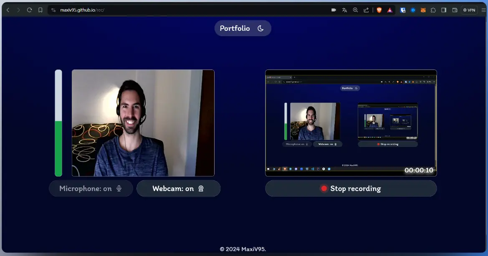

# rec

Sitio web para grabar pantalla con webcam y micrófono. 

Al habilitar la webcam, tiene la opción posicionar el video en cualquier parte de la pantalla. 

Finalmente al comenzar la grabación comparte 'Toda la pantalla' para capturar también la webcam. 

Solo disponible para navegador de escritorio.

Creado con Astro, HTML, TailwindCSS y JavScrypt vainilla.